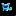
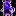
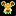
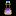
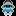
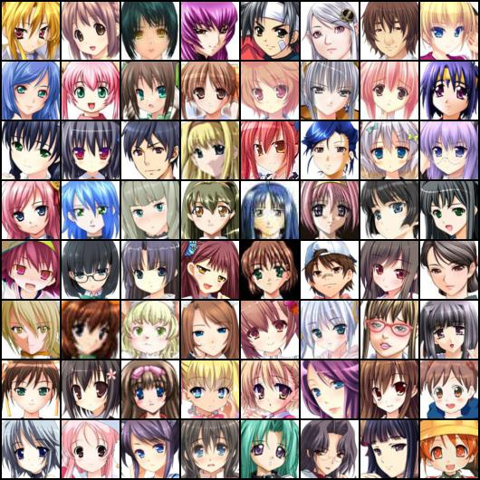
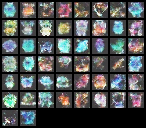
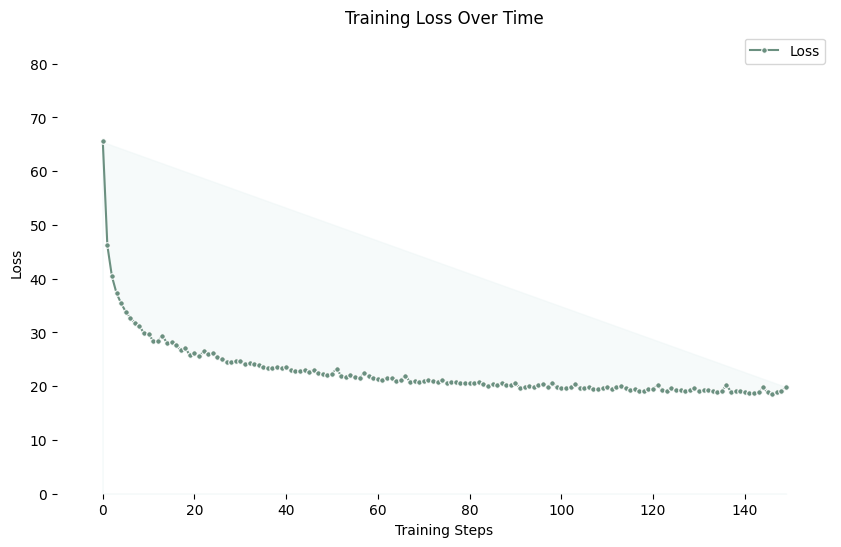
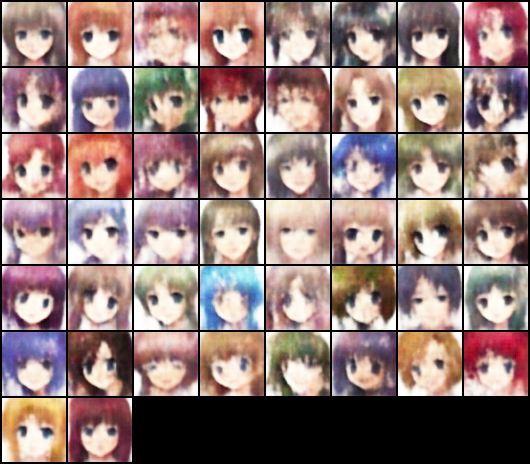

In this project I plan to use various methods to generate Pokemon and other images, including variational autoencoders (VAEs), generative adversarial networks (GANs), and VAE-GANs. 

# Image Generator with Variational Autoencoder (VAE) and Generative Adversarial Network (GAN)

I created a PyTorch implementation of a Variational Autoencoder (VAE) and a Generative Adversarial Network (GAN) for generating images. The VAE architecture is designed to learn the underlying distribution of pixel art and generate new samples from this distribution. The GAN architecture focuses on trying to create images that can't be easily distinguished from the original dataset. 

## Overview

A Variational Autoencoder is a generative model that learns a compressed, latent representation of data. It consists of two main components:

* **Encoder:**  The encoder network takes an input image and compresses it into a lower-dimensional latent vector. This vector represents the essential features of the input image.  The encoder outputs the mean $\mu$ and log variance $\sigma$ of a distribution in the latent space.
* **Decoder:** The decoder network takes a sample from the latent space (obtained by reparameterization using $\mu$ and $\sigma$) and attempts to reconstruct the original image.

A Generative Adversarial Network is comprised of a generator and a discriminator trained simultaneously and in connection with each other. This adversarial training essentially allows the discriminator to improve, making the generator's task harder and harder and ultimately producing a more realistic and robust image generator. 

- **Discriminator:** The discriminator accepts an image and outputs the probability that the image is real given the training data. 
- **Generator:** The generator takes in a random noise vector and generates a new (fake) image. The goal of the model is to produce realistic enough data to fool the discriminator. 

## Datasets

I used a pixel art dataset that is available on [Kaggle](https://www.kaggle.com/datasets/ebrahimelgazar/pixel-art/data). It contains 89,000 16x16 RGB pixel art images. A few example images from the data are shown below. 

<table>
  <tr>
    <td></td>
    <td></td>
    <td></td>
  </tr>
  <tr>
    <td></td>
    <td></td>
    <td></td>
  </tr>
</table>

I also tested the variational autoencoder model on an anime faces dataset from [Kaggle](https://www.kaggle.com/datasets/splcher/animefacedataset). It contains 63,632 images.




## Architecture

### Variational Autoencoder

The architecture of the VAE used in this project is shown below. It is made up of convolutional layers. For pixel art the hidden dimensions I used were 32, 64, and 128, but the VanillaVAE class is meant to be adaptable for any number of layers. Check the pixelart_pipeline file under src/pipelines for the specific implementation. For the anime face generation, I used up to 512 hidden dimensions. 


**Encoder:**

* Input: 16x16x3 pixel art images, or 64x64x3 for anime art images.
* Convolutional layers (Conv2D) with kernel size 3, stride 2, and padding 1 are used to downsample the input and extract features.
* Batch Normalization (BatchNorm2D) and LeakyReLU activation are applied after each convolutional layer.
* The output of the convolutional layers is flattened and passed through two linear layers to obtain the mean (μ) and log variance (logvar) of the latent distribution.

**Latent Space:**

* The latent vector `z` is sampled from a normal distribution using the reparameterization trick: `z = μ + σ * ε`, where `ε ~ N(0,1)` and `σ = exp(0.5 * logvar)`.

**Decoder:**

* The decoder takes the latent vector `z` as input.
* A linear layer maps the latent vector back to the last hidden layer (128).
* Convolutional transpose layers (ConvTranspose2d) with kernel size 3, stride 2, padding 1, and output padding 1 are used to upsample the feature maps.
* Batch Normalization and LeakyReLU activation are applied after each ConvTranspose2d layer.
* The final layer consists of a ConvTranspose2d layer followed by a Conv2D layer with a TanH activation function to produce the reconstructed image.

**Loss Function**

The loss function is a standard reconstruction error and KL Divergence loss (which attempts to structure the latent space to be more like a Gaussian distribution). 


## Code

The code for the VAE is implemented in PyTorch and is available in the `src/model_architectures/VAE/model/vae_model.py` file.  The `VanillaVAE` class defines the architecture and the `encode`, `decode`, and `forward` methods. I implemented a PyTorch training class, which runs each epoch, updates the model weights, and tracks loss and images over time. This is located under `src/training_scripts/train_vae.py`. See below for a full example implementation using this classes. If you follow the installation instructions provided further down below, you can interact with these classes in your own scripts simply by importing the library elements. 

```python
from src.utils.dependencies import *
from src.data_loaders.pixelart_handler import PixelArtDataset
from src.model_architectures.VAE.model.vae_model import VanillaVAE
from src.training_scripts.train_vae import TrainVAE

# Example instantiation of the VAE
model = VanillaVAE(
    in_channels=3,
    latent_dim=16,
    hidden_dims=[32, 64, 128]
).to(device)

# Load data
dataset = PixelArtDataset()
dataloader = DataLoader(dataset, batch_size=50, drop_last=True)

# Create optimizer
optimizer = optim.Adam(model.parameters(), lr=3e-4)

# Create a trainer
trainer = TrainVAE(
    model=model,
    optimizer=optimizer,
    epochs=150,
    batch_size=50,
    data=dataloader, 
    xdim=(3,16,16),
    device=device,
    write_results="src/results/training/150epochspixelart",
    save_images=True,
)

trainer.train_model()
```

I implemented similar functionality for the GAN, where the discriminator and generator models are defined under `src/model_architectures/GAN/dcgan.py`. Each defines the model and implements a forward method. The training loop for the GAN can be found under `src/training_scripts/train_gan.py`, which maintains the TrainGAN class that runs the training loop by  giving the discriminator fake data to test, generating an image with the generator and calculating its loss based on the discriminator's evaluation of the image, and logging generated images over time. `src/pipelines/pixelartgan_pipeline.py` maintains code structured similar as that for the VAE shown above, but using these classes instead. 

## Initial Results

The figure below shows images generated from a sample from the VAE latent space after training for 150 epochs on pixel art images and with the configuration discussed above.



The following image depicts the training loss over time for the model. 



For the GAN, the image below shows the output generations after only 8 epochs. Importantly note that I used the full dataset for this, rather than the 10000 images used to train the VAE. I also upscaled the original images to have a width and height of 64 pixels instead of 16. 


Below shows the results I got training the variational autoencoder on anime face images, after 50 epochs. 




### To Replicate Results

Run the following commands to clone the repository, setup/install the library and requirements, and run the pipeline discussed above. 

```bash
git clone https://github.com/smiley-maker/PixelMon.git

cd PixelMon

pip install -e . 

python -m src.pipelines.pixelart_pipeline

# or 

python -m src.pipelines.pixelartgan_pipeline
```

This should start model training based on my current pipeline. 


## List of Files

``src``: All code is contained inside this directory. 

`src/data_loaders`: This folder contains files to load in different data sources (images). All the implemnted scripts are compatible with PyTorch DataLoaders, as demonstrated in the example pipeline above. Currently implemnted data loaders are: 

- `pixelart_handler.py`: This is the primary dataset I've tested so far. The images are sized to 16 by 16 and as described above. The class inherits the PyTorch Dataset class, and can be loaded into a DataLoader. Additionally, it provides functions to gather the images from an external data folder (specified at the top of the file), and a get item function that resizes, permutes, and normalizes the image, returning a tensor. 
- `pokemon_handler.py`: I plan to work with this dataset next to generate Pokemon images. I also am considering training on both pixel art and pokemon to get some interesting effects, particularly because the pokemon dataset I'm using only has 900 images. The images are sized to 64 by 64 in this case. I have had luck testing on this size with the default hidden layer sizes provided in the VanillaVAE model. 
- `landscapes_handler.py`: This [Kaggle](https://www.kaggle.com/datasets/utkarshsaxenadn/landscape-recognition-image-dataset-12k-images) dataset includes 12,000 images of various landscapes in 5 categories. The data loader walks through all directories and gets all 12k images. Currently the images are resized to 224 by 224. I plan to try this dataset in the future to generate landscape images. 
- `mnist_handler.py`: loads in the MNIST data from torchvision. Currently just maintains a traning and testing set, but more functions might be added in the future. 

`model_architectures`: This folder will contain all of the implemented models. Currently, the following files exist in the folder:

- `GAN/dcgan.py`: This file contains a PyTorch model class for a convolutional GAN. Specifically, both a Generator and a Discriminator class are implemented that inherit from nn.Module and maintain forward methods so that they can be directly called similar to ```model(x)```. 
- `VAE/model/base_model.py`: This inherits from nn.Module and provides the essential structure for a variational autoencoder, but does not have any implemented code. 
- `VAE/model/vae_model.py`: This contains the primary VanillaVAE class, along with some other experimental classes, which inherits from the base model. The forward method allows an instantiated model to be called directly as model(), without having to specific .forward() or .encode() for example. 

`pipelines`: The pipelines folder can be considered essentially like the frontend of the library. It interacts with it the same way as if you installed and imported the code directly. The following pipelines are currently implemented: 
- `pixelartgan_pipeline.py`: This file creates a new DCGAN model (i.e. Discriminator and Generator models), loads the pixel art dataset, creates a trainer and trains the models for some specified number of epochs. 
- `pixelart_pipeline.py`: Similarly, this contains the same type of pipeline but using the VanillaVAE model instead. It also maintains some additional functions for sampling from and visualizing the learned latent space. 

`training_scripts`: The training scripts folder contains the training loop implementations for the models I've explored so far (VAE and GAN). Both files, `train_vae.py` and `train_gan.py` implement custom training architectures for the different models, supporting their loss functions and training styles (i.e. VAE uses reconstruction and KLD loss while GAN trains generator and discriminator together). 

`utils/dependencies.py`: This just imports all relevant libraries to keep the code clean in other areas. 